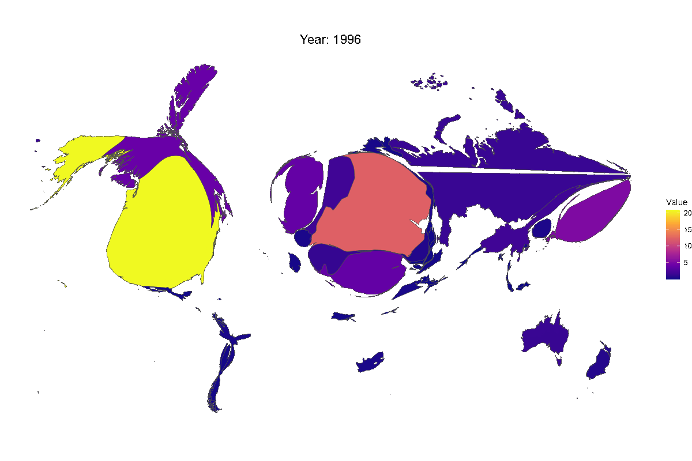
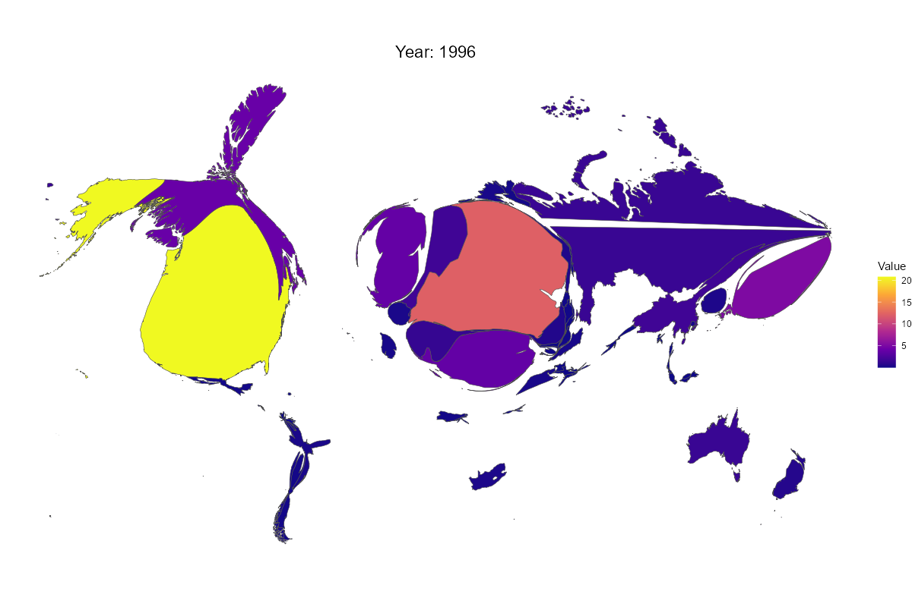
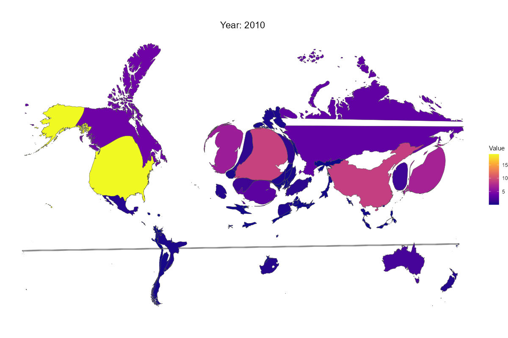
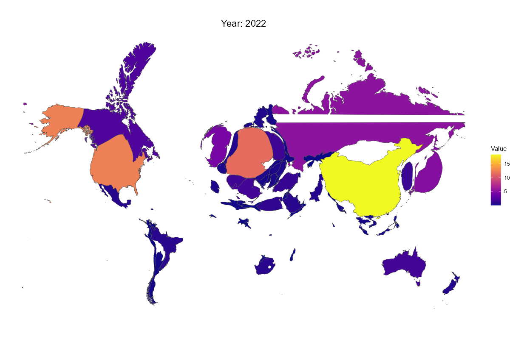

```{=html}
<iframe width="720" height="1000" src="https://hq2s4t-santiago-garc0a0r0os.shinyapps.io/chemichal-space-quartopub/" loading = "lazy"></iframe>
```


## More Countries

```{shinylive-r}
#| standalone: true
#| viewerHeight: 1000

library(shiny)
library(plotly)
library(data.table)
library(ggplot2)
library(RColorBrewer)
library(dplyr)

######### Data Preparation #########
data_url <- "https://raw.githubusercontent.com/santi-rios/China-Chemical-Dominance/refs/heads/main/data/fig_1_df.csv"

# Read data with data.table
df <- fread(data_url)
df[, Country := as.factor(Country)]
df[, substance := as.factor(substance)]

######### Custom Labels #########
figure_labels <- list(
  "Figure-12-a_b" = list(y_title = "Composite Index", map_title = "Combined Metrics"),
  "Figure2-b"     = list(y_title = "Organometallics",  map_title = "Organometallics Metrics"),
  "Figure2-d"     = list(y_title = "Rare-earths",      map_title = "Rare Earth Elements"),
  "Figure1-d"     = list(y_title = "GDP Growth",       map_title = "GDP Growth"),
  "Figure1-a"     = list(y_title = "Contribution",     map_title = "Contribution Map")
)

################
## Shiny UI   ##
################
ui <- fluidPage(
  tags$head(
    tags$style(HTML("
      .navbar { background-color: #2c3e50; padding: 10px; }
      .card { margin: 15px; border-radius: 8px; box-shadow: 0 2px 4px rgba(0,0,0,0.1); }
      .card-header { background-color: #18bc9c !important; color: white; padding: 15px; }
      .selectize-input { border-radius: 4px; padding: 8px; }
      .plotly.html-widget { border-radius: 8px; }
    "))
  ),
  
  div(class = "navbar",
      h4("Chemical Space Analysis Dashboard", style = "color: white; margin: 0;")
  ),
  
  div(class = "card",
      div(class = "card-header", "Select a Year and Maximum of 10 Countries. A random country is selected by default. Single click to select/deselect a country. Double click to select/deselect all."),
      div(class = "card-body",
          
          # Year Slider
          sliderInput("year", "Select Year",
                      min = min(df$Year, na.rm = TRUE) + 1, 
                      max = max(df$Year, na.rm = TRUE) - 1,
                      value = min(df$Year, na.rm = TRUE),
                      selected = max(df$Year, na.rm = TRUE) -1,
                      step = 1, width = "100%"),
          
          # Metric (figure) selection
          selectInput("facet", "Select Metric:",
                      choices  = unique(df$source.x),
                      selected = "Figure-12-a_b",
                      width    = "100%"),
          
          # Countries
          selectizeInput("countrySelector", "Select Countries:",
                         choices = NULL,  # filled dynamically in server
                         multiple = TRUE,
                         options = list(maxItems = 10),
                         width = "100%")
      )
  ),
  
  div(class = "card",
      div(class = "card-header", "Analytical Interactive Plots. Hover over the plots for more information. The map shows the latest data available. The cartogram is only available for the first figure."),
      div(class = "card-body",
          plotlyOutput("combinedPlot", height = "500px"),
          plotlyOutput("geoPlot", height = "400px"),
          uiOutput("cartogramImage")  # show image if "Figure1-a"
      )
  )
)

################
## Shiny Server
################
server <- function(input, output, session) {
  ###########################
  ## 1) Update country list ##
  ###########################
  observe({
    current_metric <- input$facet
    # Gather valid countries for that figure, sorted
    valid_countries <- df[source.x == current_metric, unique(Country)]
    valid_countries <- sort(as.character(valid_countries))  # alphabetical
    
    # By default, select a random country if available
    default_sel <- if(length(valid_countries) > 0) sample(valid_countries, 1) else character(0)
    
    # Update the input
    updateSelectizeInput(session, "countrySelector", 
                         choices  = valid_countries,
                         selected = default_sel,
                         server   = TRUE)
  })
  #############################################
  ## 2) Reactive subset based on user inputs ##
  #############################################
  filtered_data <- reactive({
    req(input$facet, input$countrySelector, input$year)
    
    # Filter
    df[
      source.x == input$facet &
        Country %in% input$countrySelector &
        Year <= input$year
    ]
    # We do NOT do na.omit() here, so that countries with missing Value.y
    # still appear with Value.x. We only omit if both are missing, if needed.
  }) %>% debounce(300)
  
  ########################################
  ## 3) Helper: define color assignment ##
  ########################################
  country_colors <- function(data_subset) {
    # Get the unique countries in the filtered data
    countries <- unique(as.character(data_subset$Country))
    
    # Start with an empty named vector
    color_map <- c()
    
    # If we have these countries, assign fixed colors
    if ("United States" %in% countries) {
      color_map["United States"] <- "blue"
    }
    if ("China" %in% countries) {
      color_map["China"] <- "red"
    }
    
    # The rest get free colors from a dynamic palette using colorRampPalette
    others <- setdiff(countries, c("United States", "China"))
    if (length(others) > 0) {
      pal <- colorRampPalette(brewer.pal(min(8, length(others)), name = "Set2"))(length(others))
      color_map[others] <- pal
    }
    
    color_map
  }
  
  ###########################################################
  ## 4) Combined Plot:
  ##    - Always line (Value.x) for all countries
  ##    - If "Figure-12-a_b", add points for Value.y only on rows that have it
  ###########################################################
  output$combinedPlot <- renderPlotly({
    data_subset <- filtered_data()
    if (nrow(data_subset) == 0) return(plotly_empty())
    
    # Determine the color palette
    color_map <- country_colors(data_subset)
    
    # Build the base ggplot with lines for Value.x
    gg_base <- ggplot(data_subset, aes(x = Year, color = Country)) +
      geom_line(aes(y = Value.x, linetype = Country), na.rm = TRUE) +
      scale_color_manual(values = color_map) +
      labs(
        title = paste0(
          figure_labels[[input$facet]]$y_title %||% input$facet,
          " Trend"
        ),
        x = "Year", 
        y = figure_labels[[input$facet]]$y_title %||% "Value"
      ) +
      theme_minimal() +
      theme(
        legend.position = "right",
        plot.background = element_rect(fill = "white"),
        panel.grid = element_line(color = "#f0f0f0")
      )
    
    # If we’re in "Figure-12-a_b", we also add points for Value.y
    # but only where Value.y is not missing
    if (input$facet == "Figure-12-a_b") {
      gg_base <- gg_base +
        geom_point(
          data = data_subset[!is.na(Value.y), ],  # only plot points where Value.y exists
          aes(y = Value.y, shape = substance),
          size = 2, alpha = 0.8, na.rm = TRUE
        ) +
        scale_shape_manual(values = c(16, 17, 15, 18), na.translate = FALSE)
    }
    
    # Convert to plotly
    p <- ggplotly(gg_base, tooltip = c("x", "y", "colour", "shape")) %>%
      layout(
        legend = list(orientation = "v"), # , y = -0.3
        hovermode = "closest"
      )
    
    # If "Figure1-d", add certain annotations
    if (input$facet == "Figure1-d") {
      p <- p %>% layout(
        annotations = list(
          list(x = 2020, y = 10, text = "COVID-19", showarrow = FALSE,
               font = list(size = 8)),
          list(x = 2007, y = 15, text = "Global Financial Crisis", showarrow = FALSE,
               font = list(size = 8))
        )
      )
    }
    
    p
  })
  
  ##################################
  ## 5) World Map (using Value.x) ##
  ##################################
  output$geoPlot <- renderPlotly({
    data <- filtered_data()[Year == input$year]
    if(nrow(data) == 0) return(plotly_empty())
    
    # Use Value.x on the map
    val_label <- figure_labels[[input$facet]]$y_title %||% "Value"
    
    plot_geo(data, height = 300) %>%
      add_trace(
        z       = ~Value.x,
        color   = ~Value.x,
        // colors  = "Blues",
        // colorscale="Viridis",
        colorscale="Purples", // Purples, Greens, Reds, Blues
        locations = ~iso3c,
        text    = ~paste(Country, "<br>Value.x:", round(Value.x, 2)),
        hoverinfo = "text",
        marker  = list(line = list(color = "white", width = 0.3))
      ) %>%
      colorbar(title = val_label) %>%
      layout(
        title = paste(
          figure_labels[[input$facet]]$map_title %||% "Map",
          "in", input$year
        ),
        geo = list(
          showframe = FALSE,
          projection = list(type = "natural earth"),
          bgcolor = "rgba(0,0,0,0)"
        )
      )
  })
  
  ###########################################
  ## 6) Cartogram image if "Figur-12-a_b"    ##
  ###########################################
  output$cartogramImage <- renderUI({
    req(input$year)
    if (input$facet == "Figure-12-a_b") {
      tags$div(
        style = "text-align: center; margin-top: 10px;",
        tags$img(
          src = paste0("cartograms/", input$year, ".png"),
          style = "max-width: 100%; height: auto;"
        )
      )
    } else {
      return(NULL)
    }
  })
}

shinyApp(ui, server)
```

## Cartograms

::: {layout="[[1], [1, 1, 1]]"}







:::
